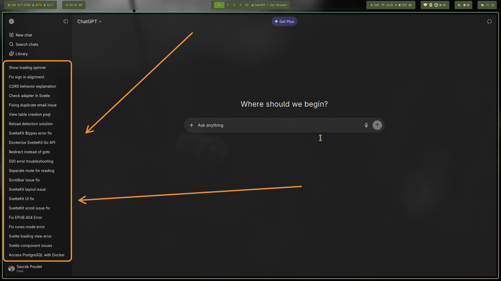
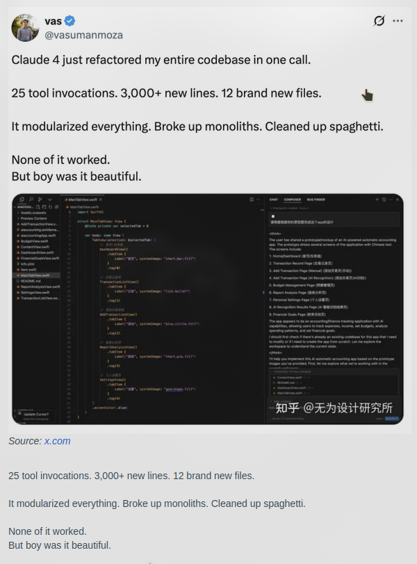

# Books - Your Personal Digital Library

#### Video Demo: [Youtube](https://youtu.be/6p8K6DyKgzk)

#### Description:

I built this webapp called "Books" - it's basically my attempt to create a digital library to read books and give it my spin. The main purpose was to learn a new language, touch as many real-world technologies/tools as possible and implement them in a single app that could be a real world application.

## The Origin Story

This whole thing started because I was using Aquile Reader, a Windows and Android EPUB reader. It was actually pretty good - great UI, customizations, looked awesome. But here's the thing: I use Linux, and while it worked on Windows (kind of laggy on VM and stuttery with book upload limitations) and Android, it was just another free software whim on Windows. They offered free premium during development, then introduced paid plans, ads, and limits. Classic "free application" move, right?

So I decided to recreate that great UI experience for EPUB reading, but make it a web app and actually free. I've been wanting to build this for a while, and CS50x gave me the perfect opportunity to finally do it. It's still not complete (I have a lot of features to implement before I'd call it a decent EPUB reader), but it's getting there.

## What the Heck is This?

Think of it as your personal digital bookshelf, but actually good. You can upload your EPUB files, organize them, read them in a beautiful interface, and track your reading progress (yet to save on backend and load on page load, only works client-side for now and is lost on reload). It's like having a library in your pocket that includes everything, from cooking recipes to programming documentation or fun stories.

## The Tech Stack (Because Apparently That Matters)

I went full-stack on this one, which means I probably overcomplicated things but hey, that's how we learn, right?

**Frontend**: SvelteKit with TypeScript - I was originally planning to use Electron or Tauri for cross-platform, but SvelteKit looked promising and I had some web development experience. I discovered SvelteKit through Fireship's videos and didn't want to overcomplicate and abandon this project halfway. Plus, I knew I could always wrap it in Tauri later if I want a native app (knew this from showcase on SvelteKit Discord community).

**Backend**: Go (Golang) - Started with a simple Go auth tutorial from YouTube (Alex Mux and Consulting Ninja), but it evolved into something much more complex. I considered learning and using Rust but the syntax looked weird for me, so Go it is. I appreciate Go's simplicity and the fact that it compiles to a single binary, is concurrent and fast (for the CS50 finance problem set I wanted to make concurrent requests and caching, but failed to do so).

**Database**: PostgreSQL - Reliable, well-documented, and supports all the features I needed (I didn't even know I could add custom functions and other features in languages like SQL, C, even Python - I never used it but good to know). Plus, it's free and I was introduced to SQLite3 in the course, so PostgreSQL it is.

**File Storage**: MinIO - S3-compatible storage (I didn't know at the time of implementation what this was - I just wanted a way to get users files to their own folder and can't access another folder and an easy way to work with Golang). MinIO provides an official Go Client SDK for interacting with MinIO servers and any Amazon S3 compatible object storage. ChatGPT suggested this, and it's perfect for self-hosting. Companies use this, so if my app grows, I won't regret the choice.

**Authentication**: JWT tokens with refresh tokens, plus Google OAuth. The authentication flow was probably the hardest part to get right.

## The Architecture (AKA How I Made This Mess)

### Frontend Structure

- **`frontend/src/lib/`** - This is where all the good stuff lives:

- `NavBar.svelte` - The navigation bar that stays at the top. Pretty straightforward, but it took me way too long to get the responsive design right, and I have SvelteKit slots here. I can import wherever I need and add different buttons. On the homepage there's a logo on the left, nothing in the center, and login/signup on the right. On the library page, it's the same navbar but with search in the center and upload/store on the right with a user icon on the far right. I can toggle the additional view that has filter purposes on the library page but it's hidden on the homepage - could say it's just a sticky black acrylic background with button/elements placeholders.

- `Login.svelte` & `Signup.svelte` - The authentication pages. I added some nice animations and validation because users deserve better than "invalid input" errors. The errors are as helpful as they could be. The signup process asks for email and 8 character password, and sends form (email and password) to backend route /api/register/request( anything with /api would be forwarded to localhost:8080 by nginx) and it responds with ok then the signup page redirects user to /signup/verify page where they enter the 6 digit pin. This submits pin to /api/register/verify - the pin will be sent to their provided email using SendGrid API service. The backend saves the code in db(email_verifications table). The /api/register/verify expects mail and code, and checks for the code and mail match in email_verification table, and if matched, creates user and minio bucket then redirects to success page, where user can go to login or home page. 
The pages /signup/verify and signup/success are one time pages for signup only and cannot be visited as Svelte guards it with tokens. The token "pending" is set by signup page, and verify page checks for that, extracts mail from URL and deletes that token so if user reloads the page or tries to access that page without signup redirection, they will be redirected to signup page and after the successful verification, it creates another token "registered" and redirects to /signup/success page, it checks for the registered token shows the page and deletes it.

- `BookCard.svelte` - Each book gets its own card with a cover image, title, author, and reading progress. I'm pretty proud of the hover effects on this one. And upon hover it shows open button that opens the reader. I load this on page load with all the books fetched and parsed from /api/protected/library. This returns file URLs and EPUB.js parses it. If there is no provided cover, I have one for default, a burning candle.

- `BookReader.svelte` - The actual e-reader component. This was the hardest part - integrating EPUB.js to render books properly. It supports dark/light mode, chapter navigation, and progress tracking (only client-side for now as I haven't implemented the backend logic to store the progress, so it's lost on page reset for now). I used EPUB.js and theming was a bit of a struggle - I did use ChatGPT here and navigated multiple GitHub projects and issues for it to work.

- `EpubUpload.svelte` - Handles file uploads and metadata extraction. I even added a worker pool for parsing EPUBs in the background so the UI doesn't freeze (ChatGPT helped me here). And upon upload I also update the library for the newly added book with its own book card.

- `SearchBar.svelte` - A search component that looks good and actually works. Revolutionary, I know (got it from uiverse.io 😆). It searches for matching author and book title.

### Backend Structure

- **`backend/internal/handlers/`** - All the HTTP endpoints:

- `router.go` - The traffic controller that routes requests to the right handlers.

- `login.go` & `google.go` - Handle authentication. The Google OAuth flow was surprisingly straightforward once I figured out the redirect URLs. Both the login and Google login will issue two HTTP-only tokens on successful login. One is Access token and other is refresh token. Access token gives access to protected routes such as /api/library checked by jwt.go in middleware. The unprotected routes are not wrapped in JWT middleware in routes.go. The refresh token just refreshes tokens, deleting previous refresh token and issuing new set of tokens.

- `library.go` - Manages the book library, file operations, and user permissions. Users can only access their own books. There are some empty/dummy functions as well for future features I plan to implement.

- `upload.go` - Handles file uploads to MinIO. I added proper validation and error handling because users will upload anything.

- `refresh.go` & `logout.go` - Token management. The refresh token system prevents users from getting logged out every 15 minutes. When requested with valid refresh token the refresh route /api/refresh checks for the refresh tokens in table refresh_tokens, removes used refresh token and issues fresh set of tokens if matched with gmail and token else, returns unauthorized. The logout expires and removes the refresh tokens from database.

- `request_verify.go` & `verify.go`** - These are part of the signup process. the request_verify.go ensures there are no duplicate emails, and handles sending 6 digit pin code to that email and saving it in the email_verifications table. The verify.go looks for the matching email and code, and if found creates users and bucket for that user.

- **`backend/internal/auth/`** - The security stuff:


- `service.go` - The main authentication service. It's like the brain of the security system, where all the service functions and their helper functions live. This file got way more complicated and large and I have to search for what functions here do in order to update/add new features.

- `jwt.go` - JWT token creation and validation. I used the v4 library because it's the latest and greatest. It just issues signed tokens and parses it with JWT secret.

- `bcrypt.go` - Password hashing. Because storing plain text passwords is not secure.

- **`backend/internal/store/`** - Database operations (PostgreSQL). This is the most important part. I kind of rely a bit too much on PostgreSQL, just querying filtered results. Like the verification code expires in 5 minutes and I don't have anything else checking on it except for the database query that queries the rows with time comparison like this:

```go
row := p.db.QueryRowContext(context.Background(), `
    SELECT hashed_password FROM email_verifications
    WHERE email=$1 AND code=$2 AND expires_at>now()
`, email, code)

if err := row.Scan(&hashedPw); err != nil {
    return "", err
}
```

- **`backend/internal/models/user.go`** - Data structures

- **`backend/internal/middleware/`** - cors.go basically outright rejects any requests from domains other than the configured ones (localhost:4353 for dev and books.saurabpoudel.com.np for production) and JWT middleware validates the token.

### Infrastructure

- **`docker-compose.yml`** - Orchestrates all the services. I have:

- Nginx reverse proxy (port 4353)
- SvelteKit (port 3000) frontend
- Go backend (port 8080)
- PostgreSQL database (port 5432)
- MinIO file storage (port 9000/9001)
- Automatic database backups (because losing data is not cool. I also have not looked into how I would use them 😆)

## Key Features (The Stuff That Actually Works)

### Authentication System

I built a proper authentication system with JWT tokens, refresh tokens, and Google OAuth. The JWT tokens expire every 15 minutes for security, but the refresh tokens last 7 days so users don't get annoyed. I also added email verification for new accounts because spam accounts are the worst, and I have Cloudflare DDoS protection enabled on the Cloudflare dashboard that adds some layer of protection as I don't think my app is foolproof secure.

### EPUB Reader

The reader component is probably the most complex part. It uses EPUB.js to render books, supports continuous scrolling (because pagination was annoying - I'll be adding an option but for now it's the only option), has dark/light mode, and tracks reading progress. I even added a table of contents and chapter navigation.

### File Management

Users can upload EPUB files, and the system automatically extracts metadata (title, author, cover image) using a web worker pool and creates a new book card for the newly added books. The web worker parses super fast, and doesn't freeze the UI when parsing large books. Files are stored in MinIO with proper access controls - users can only access their own books.

### Responsive Design

The whole thing works on desktop, tablet, and mobile. I used Tailwind CSS because writing custom CSS is like writing poetry - beautiful but time-consuming (It's not true, CSS is good and I have some, and it might seem crazy to use with Tailwind but it works and I wanted to give it a shot. I'm scared to use CSS because I don't have good experience with it and frequently broke stuff, and it's my least favorite to work with).

## Design Decisions (And Why I Made Them)

### Why SvelteKit?

I was originally planning to use Electron or Tauri for cross-platform development, but I discovered SvelteKit through Fireship's videos and it looked promising. I also watched "100 seconds of SvelteKit" and Svelte so I have 10 years of experience just from that video (No I don't and it was painful to figure out the authentication especially refresh token). I had some web development experience, so it made sense to start there. I didn't want any more complex things for now and Rust syntax was kind of terrifying, and not Electron because of community saying it's a memory hog (didn't really know, cause I use VSCode and works fine) and I was a beginner and wanted to avoid unwanted complexity.

### Why Go for the Backend?

I started with a simple Go auth tutorial from YouTube, but it evolved into something much more complex. I appreciate Go's simplicity and the fact that it compiles to a single binary and is fast (faster than interpreted) and no memory management like C. The standard library is comprehensive, and there's official support for things like MinIO (which I didn't know when I chose Go). The main reason was file uploads and concurrency; I tried to use parallel processes in Python for the CS50 finance problem set, but at that time I couldn't get it to work.

### Why PostgreSQL?

I was introduced to SQLite in the course, and PostgreSQL felt like the natural next step for a full-featured, reliable, and open-source relational database. I used Docker version of Postgres because I wanted to use Docker for the deployment. I had some experience with Portainer (Docker container manager with web UI) just deploying and tinkering in VM.

### Why MinIO?

I wanted S3-compatible storage for reliable backup for the future just in case. ChatGPT suggested this, and it's perfect for self-hosting. Companies use this, so if my app grows, I won't regret the choice.

## The Struggles (Because Nothing Works on the First Try)

### Authentication Flow - The Biggest Headache

This was probably the hardest part. I struggled the most with understanding how SvelteKit server-side, frontend (client browser), and backend communication worked with tokens. The issue was with refresh tokens - SvelteKit server would request a refresh from the backend, but the browser had no idea the refresh token was used (and I delete used refresh tokens). I almost removed the refresh token implementation entirely because I wanted to make the sveltekit only to request from backend and not expose backend to internet, but decided to integrate everything to the frontend (client browser) instead. Not sure how secure this is, but it works.

### EPUB Parsing

Getting EPUB.js to work properly was challenging. The documentation is sparse, and the API changes between versions. I ended up creating a worker pool to handle parsing in the background, which was actually a fun challenge.

### Theme Switching Issues

When implementing smooth scrolling, I broke the dark mode on EPUB.js. The issue was that it would only change theme once loaded and on scroll to next page (that was EPUB rendering and I was applying theme on rendition after registering theme). This happened more times than I like to admit, fix one thing and another was broke and it took me a while to figure out. Here is my actual commit message:

```
󰣇 ~/Documents/Final project  master  !? ❯ git checkout

f4b36116 -- [HEAD~11] introduced and fixed bug on previous commit theme change fix (5 days ago)
aeed0fd5 -- [HEAD~12] minor svelte.config fixes for styling as blobs for epub (5 days ago)
7a214f00 -- [HEAD~13] added another view for bookreader and loading for the jittery experience (introduced the doubling book on closing overlay issue and fixed it lol) (5 days ago)
f09ce494 -- [HEAD~14] csp header added for security and works with blob as well(for epub js parsing and returning blob urls for book cover) (5 days ago)
```

### File Uploads

Handling large file uploads with proper progress tracking (only client-side progress tracking - I don't save it to the database and refresh wipes it out for now) and error handling was trickier than expected. I added file size limits, type validation, and proper cleanup for failed uploads.

### Docker Setup

Getting all the services to work together in Docker was like herding cats. Had to learn the networking between containers, environment variables, took way longer than I'd like to admit, and ChatGPT came to help.

## What I Learned (The Good Stuff)

This project taught me a lot about full-stack development, containerization, and building a real application that people might actually use. I learned about:

- **Web Workers and background processing** - Never knew I could detect clients' CPU cores and use web workers to do stuff on my clients' browser. Not sure how it affects UX, when opening multiple browser tabs, I use all cores for parsing. I create workers based on how many logical cores are available (pretty sure browser should handle and make available/claim back resources used by my workers/parser).

- **JWT authentication and security best practices** - Like session-based and JSON web tokens (how I get automatically logged in on sites I visit like Notion - I get it now)

- **Docker orchestration and microservices** - Honestly I still don't get it fully and it barely works on my current setup, but cool thing was once it worked, it just ran with no hassle when deploying on CloudPanel over on the Ubuntu server, no hiccups. I didn't download/install Node, Go, manually ran any containers, just `git pull` created envs and `docker-compose --env-file ./.env up --build -d` just worked!

- **GitHub** - My project is a private repository, and when I push new changes, I didn't want to manually download zip, scp my file to Ubuntu server and then run docker-compose. But I didn't have to, I created a deploy key for my repository with read access, and set it up on Ubuntu server to use it, then I can now just do `git pull` to pull latest changes once cloned! Pretty awesome right? I also have bash script called deploy.sh that just does this for me when I do ./deploy.sh.

- **EPUB file format and parsing** - I thought .epub was file type like .jpg for image, turned out it's an archive style, with structure and multiple files, like HTML/XHTML, CSS, fonts inside. I didn't know there could be images inside .epub files.

- **Responsive design and user experience** (with no users 😆) - Tailwind was such an awesome experience, I can change styles for one element without worrying what button will disappear. I also later found uiverse.io (got search bar and a form) and DaisyUI (the loading ripple) wish I could found these sooner, as it would have helped me build frontend a bit faster. Uiverse components could be copied in any library like Svelte or HTML & CSS which was awesome! I also found Lucide, they have icons for all I could want. I remember for my first website finding free icons downloading it in PNG, converting to SVG.

- **Database design and optimization** - For now I have one main users table that stores email and hashed passwords with unique ID, other for email verification which saves time, email and code, and upon duplication saves new time and code but updates instead of adding another code entry with duplicate email. I thought of clearing this table periodically but seems unnecessary for now, I do have a function that runs once every 24 hours but commented out in internal/store/postgres.go after knowing it's just few MB for lots of rows!

### The Backend Developer Meme

At one point, I looked at my app and realized the majority of my efforts were in the backend, while the frontend was still pretty basic (just as I left it weeks ago). I finally understood the meme about backend developers staring at frontend developers who just changed color of a button. I couldn't see as a client (when visiting the web app) what I did on the backend myself. But I don't regret it - I now have a solid understanding of cookies, authentication, and I can reuse this exact Go backend for future apps authentication flow.

### Testing and Development Tools

I mostly used curl and scripts for testing the backend (like the `checker.sh` script in the backend folder), but I discovered Postman and it's actually pretty useful for testing API endpoints. I also learned to appreciate Git more after losing 6 hours of work to VSCode crashing (auto save on no errors was on but Svelte component was screaming because of unused CSS selector and didn't save and my laptop doesn't hold power, just shuts off on power outage). Now I stage changes regularly and commit frequently. Also almost screwed up with Git as well because I used to checkout my previous commits frequently with `git checkout` but before this I knew `git reset --hard "head"` thinking I can come back to this but it was gone, thankfully it was not much that was lost. I also feel why documentation and logging is important, I don't have one and I forget why was that there(even in fairly small project like mine), and the only message I can look up for now is comments and commit messages. I'll be implementing a bit more detailed documentation for this project later on.

## Future Improvements (I Look forward to)

- Add support for other book formats (PDF, MOBI) - My dad said he would use an app like this to add his books (Nepali, Hindi, and Sanskrit) as he likes to read stories and poems (Ramayana, Puranas). I might need to add conversion or accept more formats.
- Forgot password functionality (Top priority)
- Delete books feature
- Add language options and natural sounding text to speech (as requested by my first client - my dad)
- Implement book recommendations
- Add social features (sharing, reviews)
- Add reading statistics and analytics
- Implement offline reading support as a PWA (progressive web application, that popup to install it as an app to use it offline)
- Page flipping animations for paginated view
- Global EPUB store (though I have no idea how to implement this legally - I don't want to illegally distribute authors' work, only books that authors themselves made available to read for free)

## How to Run This Thing

1. Get the source file and Open .env_template then fill in your configuration(as per the names) and save it as .env 
2. Run `docker-compose --env-file ./.env up --build -d`
3. Visit `http://localhost:4353`

The setup is pretty straightforward thanks to Docker, but you'll need to configure Google OAuth (authorized JS origin, callbacks and redirect URLs) and SendGrid (for local accounts) for email verification if you want all the features to work.

## Deployment

I deployed this on Oracle Cloud Free Tier with Ubuntu server and CloudPanel which I installed and set up myself. I used my domain `books.saurabpoudel.com.np` (provided by Mercantile Communications free of charge for Nepali citizens to encourage digital adoption). The app runs on port 4353 with Nginx as a reverse proxy entrypoint, forwarding `/api` requests to the Go backend and everything else to SvelteKit on port 3000, and behind another reverse proxy of CloudPanel that handles SSL certificates for me. I just created a DNS entry on Cloudflare dashboard and pointed the IP to Oracle (CloudPanel server), created reverse proxy for the subdomain that points to localhost:4353! and it was live on internet. It's live now and you can check it out at:

[books.saurabpoudel.com.np](https://books.saurabpoudel.com.np/)

## CI/CD (GitHub Actions)

This repository now includes a GitHub Actions pipeline for CI and CD:

GHCR note: you do not need a separate GHCR account; GHCR uses your existing GitHub account/organization.

- `.github/workflows/ci.yml`
    - Runs on `pull_request` and `push`
    - Frontend checks: install, lint, type-check, unit test, build
    - Backend checks: `go build` and `go vet`
    - Docker smoke builds for frontend and backend images

- `.github/workflows/cd.yml`
    - Auto deploy runs only after CI succeeds on the default branch (`master` in this repo; `main` also supported) via `workflow_run`
    - Manual runs supported through `workflow_dispatch`
    - Supports rollback mode with an explicit image tag
    - Builds and pushes multi-arch images (`linux/amd64`, `linux/arm64`) to GHCR:
        - `ghcr.io/<owner>/bookapp-frontend`
        - `ghcr.io/<owner>/bookapp-backend`
    - Deploys on a self-hosted Linux runner with label `bookapp-prod`

- `docker-compose.prod.yml`
    - Production override that switches frontend/backend to GHCR images
    - Production backup service writes to a Docker named volume (`db_backups`) instead of the repository `./backups` folder

### One-time setup for CD

1. Install and register a self-hosted GitHub runner on your Ubuntu server.
2. Add the runner label `bookapp-prod` and ensure only your production runner has that label.
3. Ensure the runner user can run Docker commands (for example, in the `docker` group).
4. Keep your production env file on the server (example: `/opt/bookapp/.env`) with the same keys used by this project.
5. In GitHub repository settings, add Actions variables:
     - `BOOKAPP_ENV_FILE` = absolute path to the server env file (example: `/opt/bookapp/.env`)
    - `BOOKAPP_SMOKE_URL` = optional frontend smoke URL (default: `http://localhost:4353/`)
    - `BOOKAPP_API_SMOKE_URL` = optional backend smoke URL (default: `http://localhost:4353/api/healthz`)
6. Enable branch protection on your default branch (`master`) and require the CI checks from `.github/workflows/ci.yml` before merge.
7. Merge changes to your default branch (`master`) to trigger automated CD.

Note: CD checkout on the self-hosted runner is configured with `clean: false` to avoid failures from leftover root-owned files in persistent workspaces.

Deployment command used by the workflow:

```bash
docker compose --env-file "$BOOKAPP_ENV_FILE" -f docker-compose.yml -f docker-compose.prod.yml up -d --no-build
```

### Rollback

1. Open GitHub Actions and run the `CD` workflow manually.
2. Set `deploy_mode` to `rollback`.
3. Set `rollback_tag` to a known-good image tag (for example, a previous commit SHA tag).
4. Run the workflow.

The deployment will skip image build, pull the selected tag, redeploy the stack, and run smoke checks.

## Final Thoughts

Building this was a lot of fun, even though it took way longer than I expected (I started on 5th July 2025). There's something satisfying about creating a tool that you'd actually want to use yourself. The code is probably not perfect (what code ever is?), but it works, it's secure (as best of my knowledge), and it doesn't make me want to throw my computer out the window (because I couldn't hit X on ads Microsoft).

CS50x gave me the confidence to tackle this project, especially the data structures and SQL parts. I never worked with databases before. Data structures made me realize that "data" is just bits and bytes I could do anything with data - the formats are just different ways to address certain scenarios/problems.

Although AI is getting better at writing code, when I first started my project (before following the Alex Mux : "Golang Project: Building a Secure Login Portal" Auth tutorial), I used AI snippets. Some worked, but these caused so many headaches because I didn't know what each part did. As my project grew, AI just pointed out possible issues without clear fixes (copy pasted and broke everything couple of times 😆). Now I check every AI suggestion to make sure it's actually something I need and helps me if so I implement it for my code. It's still useful for tips — like information on topics I barely know, security best practices, how Docker works but I don't trust it blindly. That being said I did use it, and it was still more helpful than manually finding the issue I'm facing on Stack Overflow, Reddit, Discord.

Here are my screenshots of ChatGPT chats:



I used Linux as daily driver for long time, and handling issues and fixing stuff has been natural because I like tinkering and customizing things on my machine, and CS50 made me realize programming is just solving problems, at the very core. Like in the earlier days of this project, I wanted to screen record to record my progress with OBS and the screen was black. Took me few hours to fix (it was the XDG desktop portal for my window manager in case you're wondering) and next day when I was ready for recording, boom there was double cursor on my recording, another 4 hours gone (simply switching to git version of Hyprland, my window manager and XDG desktop portal Hyprland solved the issue).

I've found YouTube creators incredibly helpful. Huge thanks to the creators who kept me sane during development - Christian Lempa (nginx/proxy), NetworkChuck (Docker/Portainer, SSH, bash, IP addresses), Fireship (for 5 years of experience per topic in 100 seconds 🤣), Primeagen, Low Level, Consulting Ninja (first Go auth backend implementation), Bro Code (initial days of CS50x concepts on C), and many others. The open-source community, especially SvelteKit's Discord, has been amazing.

If you're reading this, thanks for checking out my project! Feel free to steal any ideas, give suggestions and stuff (Github repo is private for now).

## Enjoy some memes





