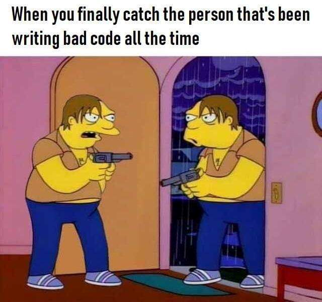
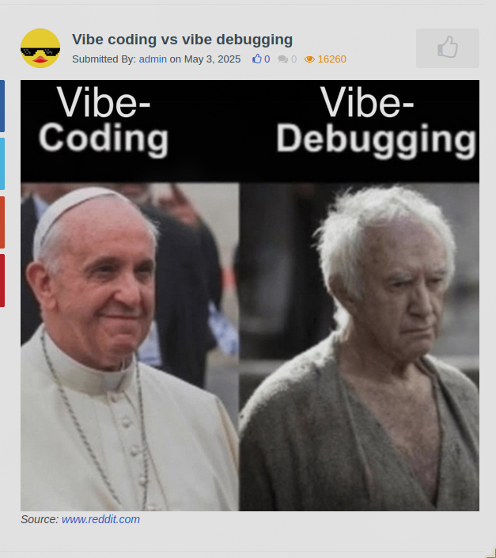

# Books - Your Personal Digital Library
#### Video Demo: <URL HERE>
#### Description:

Alright, so I built this webapp called "Books" - it's basically my attempt to create a digital library that doesn't suck and give it my spin. The main purpose for me is to learn a new language, touch as many realworld technologies/tools as possible and implement it in a single app that could be a real world application.

## The Origin Story (Because Every Good Project Has One)

This whole thing started because I was using Microsoft's Aquile Reader. Don't get me wrong, it was actually pretty good - great UI, customizations, looked awesome. But here's the thing: I daily dirve Linux for most tasks, and while it worked great on Windows(kind of laggy and stuttery with book upload limitation) and Android, it was just another Microsoft whim. They offered free premium during development, then introduced paid plans and ads. Classic Microsoft move, right?
Here's one microsoft's store reviews on aquile reader:
`
Great reader but pricy

I paid for the premium version here assuming that I would not have to pay a second time over at the Google Play Store. My assumption was incorrect. I paid $15 here and now have deleted the GPS version because they wanted another $15. Thirty bucks for an e-reader?!? I'll just have to sync my reading progress the old fashion way, manually. Buyer beware.

Michael , 7/24/2025
`

So I decided to recreate that great UI experience for EPUB reading, but make it a web app and actually free. I've been wanting to build this for a while, and CS50x gave me the perfect opportunity to finally do it. It's still not complete (I have a lot of features to implement before I'd call it a decent EPUB reader), but it's getting there.

## What the Heck is This?

Think of it as your personal digital bookshelf, but actually good. You can upload your EPUB files, organize them, read them in a beautiful interface, and track your reading progress (yet to save on backend and load on page load, only works client-side for now and is lost on reload). It's like having a library in your pocket that includes everything, from cooking recipes to programming documentation or fun stories.

## The Tech Stack (Because Apparently That Matters)

I went full-stack on this one, which means I probably overcomplicated things but hey, that's how we learn, right?

**Frontend**: SvelteKit with TypeScript - I was originally planning to use Electron or Tauri for cross-platform, but SvelteKit looked promising and I had some web development experience and didn't want to overcomplicate and abandon this project halfway. Plus, I can always wrap it in Tauri later if I want a native app (knew this from showcase on SvelteKit Discord community).

**Backend**: Go (Golang) - Started with a simple Go auth tutorial from YouTube (Consulting Ninja), but it evolved into something much more complex. I appreciate Go's simplicity and the fact that it compiles to a single binary and is concurrent and fast (for the CS50 finance problem set I wanted to make concurrent requests and caching, but failed to do so).

**Database**: PostgreSQL - Reliable, well-documented, and supports all the features I needed (I didn't even know I could add custom functions and other features in languages like SQL, C, even Python - I never used it but good to know). Plus, it's free and I was introduced to SQLite3 in the course, so PostgreSQL it is.

**File Storage**: MinIO - A S3-compatible storage(I didn't know at the time of implementation wth is this I just wanted an way to get users file to their own folder and can't access another folder and an easy way to work with golang(MinIO provides an official Go Client SDK for interacting with MinIO servers and any Amazon S3 compatible object storage.), and reliable backups and industry standard which did not matter, at least till now). ChatGPT suggested this, and it's perfect for self-hosting. Companies use this, so if my app grows, I won't regret the choice.

**Authentication**: JWT tokens with refresh tokens, plus Google OAuth. The authentication flow was probably the hardest part to get right.

## The Architecture (AKA How I Made This Mess)

### Frontend Structure
- **`frontend/src/lib/`** - This is where all the good stuff lives:
  - `NavBar.svelte` - The navigation bar that stays at the top. Pretty straightforward, but it took me way too long to get the responsive design right, and I have sveltekit slots here. I can import wherever I need and add different buttons. On the homepage there's a logo on the left, nothing in the center, and login/signup on the right. On the library page, it's the same navbar but with search in the center and upload/store on the right with a user icon on the far right. I can toggle the additional view that has filter purposes on the library page but it's hidden on the homepage, could say its just black acrylic background sticky with button/links placeholders.
  - `Login.svelte` & `Signup.svelte` - The authentication pages. I added some nice animations and validation because users deserve better than "invalid input" errors. The errors are helpful as they could be. The signup process asks for email and 8 digit password, and sends form(email and password) to backend route localhost:8080/api/register/request and it responds with ok then the signup page sends user to /signup/verify page where there input for 6 digit pin that was sent to their provided email using sendgrid api service. the backend carefully saves the code in db and on the verify page, it sends the code and mail(saved on signup page) to localhost:8080/api/register/verify that checks the code and creates users and bucket if matches the mail and code with a database lookup.
  - `BookCard.svelte` - Each book gets its own card with a cover image, title, author, and reading progress. I'm pretty proud of the hover effects on this one. And upon hover it shows open button that opens the reader. I load this on pageload with all the books fetched and parsed from /api/protected/library. this returns fileurls and epubjs parses it.
  - `BookReader.svelte` - The actual e-reader component. This was the hardest part - integrating EPUB.js to render books properly. It supports dark/light mode, chapter navigation, and progress tracking (only client-side for now as I haven't implemented the backend logic to store the progress, so it's lost on page reset for now). I used epubjs and theming was bit struggle I did used chatgpt here and navigated multiple github projects and issues for it to work.
  - `EpubUpload.svelte` - Handles file uploads and metadata extraction. I even added a worker pool for parsing EPUBs in the background so the UI doesn't freeze (ChatGPT helped me here). and upon uplaod i also update the library for the newly added book with its own bookcard.
  - `SearchBar.svelte` - A search component that looks good and actually works. Revolutionary, I know (got it from uiverse.io). It searches for matching author and booktitle.

### Backend Structure
- **`backend/internal/handlers/`** - All the HTTP endpoints:
  - `router.go` - The traffic controller that routes requests to the right handlers.
  - `login.go` & `google.go` - Handle authentication. The Google OAuth flow was surprisingly straightforward once I figured out the redirect URLs. and both will issue two http only tokens on sucessful login. One is Access token and other is refresh token. Accesstoken gives access to protected routes such as /api/library. the refresh token just refreshes tokens, deleting previous accesstoken/refreshtoken and issuing new set of tokens.
  - `library.go` - Manages the book library, file operations, and user permissions. Users can only access their own books.
  - `upload.go` - Handles file uploads to MinIO. I added proper validation and error handling because users will upload anything.
  - `refresh.go` & `logout.go` - Token management. The refresh token system prevents users from getting logged out every 15 minutes. when requested with valid refresh token the refresh token removes used refresh token and issues fresh set of tokens. the logout expires and removes the refresh tokens from database.

- **`backend/internal/auth/`** - The security stuff:
  - `service.go` - The main authentication service. It's like the brain of the security system, where all the service functions and their helper functions live. This file got way more complicated and large and i have to see and search for what used to do what in order to update/add new features. 
  - `jwt.go` - JWT token creation and validation. I used the v4 library because it's the latest and greatest. It just issues signed tokens and parses it(signature validation).
  - `bcrypt.go` - Password hashing. Because storing plain text passwords is not secure.

- **`backend/internal/store/`** - Database operations (PostgreSQL), This is most important part. I kind of rely a bit too much on PostgreSQL, just quering filtered results. Like the Verification code expires on 5 minutes and I don't have anything else checking on it except for the database query that queries the rows with time comparison like this 
`
	row := p.db.QueryRowContext(context.Background(), `
    SELECT hashed_password FROM email_verifications
    WHERE email=$1 AND code=$2 AND expires_at>now()
  `, email, code)
	if err := row.Scan(&hashedPw); err != nil {
		return "", err
	}
`

- **`backend/internal/models/`** - Data structures
- **`backend/internal/middleware/`** - CORS basically outright rejects any requests from domains other than the configured ones (localhost:4353 for dev and books.saurabpoudel.com.np for production) and JWT middleware validates the token.

### Infrastructure
- **`docker-compose.yml`** - Orchestrates all the services. I have:
  - Nginx reverse proxy (port 4353)
  - SvelteKit (port 3000) frontend
  - Go backend (port 8080)
  - PostgreSQL database (port 5432)
  - MinIO file storage (port 9000/9001)
  - Automatic database backups (because losing data is not cool. I also have not looked into how I would use them )

## Key Features (The Stuff That Actually Works)

### Authentication System
I built a proper authentication system with JWT tokens, refresh tokens, and Google OAuth. The JWT tokens expire every 15 minutes for security, but the refresh tokens last 7 days so users don't get annoyed. I also added email verification for new accounts because spam accounts are the worst, and I have Cloudflare DDoS protection enabled on the Cloudflare dashboard that adds some layer of protection as I don't think my app is foolproof secure.

### EPUB Reader
The reader component is probably the most complex part. It uses EPUB.js to render books, supports continuous scrolling (because pagination was annoying - I'll be adding an option but for now it's the only option), has dark/light mode, and tracks reading progress. I even added a table of contents and chapter navigation.

### File Management
Users can upload EPUB files, and the system automatically extracts metadata (title, author, cover image) using a web worker pool. This prevents the UI from freezing when parsing large books. Files are stored in MinIO with proper access controls - users can only access their own books.

### Responsive Design
The whole thing works on desktop, tablet, and mobile. I used Tailwind CSS because writing custom CSS is like writing poetry - beautiful but time-consuming (It's not true, CSS is good and I have some, and it might seem crazy to use with Tailwind but it works and I wanted to give it a shot. I'm scared to use CSS because I don't have good experience with it and frequently broke stuff, and it's my least favorite to work with).

## Design Decisions (And Why I Made Them)

### Why SvelteKit?
I was originally planning to use Electron or Tauri for cross-platform development, but I discovered SvelteKit through Fireship's videos and it looked promising, and I also watched 100 seconds of sveltekit and svelte so I have around 10 years of experience just from that video(No I don't and it was painful to figure out the authentication especially refresh token). I had some web development experience, so it made sense to start there. Plus, I can always wrap it in Tauri later if I want a native app, and the community on Discord was friendly and I saw their projects with Tauri and SvelteKit, the application is headache for my future self.

### Why Go for the Backend?
Started with a simple Go auth tutorial from YouTube, but it evolved into something much more complex. I appreciate Go's simplicity and the fact that it compiles to a single binary and no memory management like C. The standard library is comprehensive, and there's official support for things like MinIO (which to be fair I didn't know when I chose go). The main reason was file uploads and concurrency; I tried to use parallel processes in Python for the CS50 finance problem set to make HTTP requests concurrent but at that time I couldn't get it to work, also its compiled to a single binary and fast.

### Why PostgreSQL?
I was introduced to SQLite in the course, and PostgreSQL felt like the natural next step for a full-featured, reliable, and open-source relational database.

### Why MinIO?
I wanted S3-compatible storage (from my research this is what companies use and it's reliable) for reliable backup for the future just in case. ChatGPT suggested this, and it's perfect for self-hosting. Companies use this, so if my app grows, I won't regret the choice. 

## The Struggles (Because Nothing Works on the First Try)

### Authentication Flow - The Biggest Headache
This was probably the hardest part. I struggled the most with understanding how SvelteKit server-side, frontend (client browser), and backend communication worked with tokens. The issue was with refresh tokens - SvelteKit server would request a refresh from the backend, but the client browser had no idea the refresh token was used (and I delete used refresh tokens). I almost removed the refresh token implementation entirely, but decided to integrate everything to the frontend(client browser) instead. Not sure how secure this is, but it works.

### EPUB Parsing
Getting EPUB.js to work properly was challenging. The documentation is sparse, and the API changes between versions. I ended up creating a worker pool to handle parsing in the background, which was actually a fun challenge.

### Theme Switching Issues
When implementing smooth scrolling, I broke the dark mode on EPUBjs. The issue was that it would only change theme once loaded and on scroll to next page (that was EPUB rendering and I was applying theme on rendition after registering theme). This happened like fix one thing and another was broke and it me a while to figure out. Here is my actual commit message
 `󰣇 ~/Documents/Final project   master  !? ❯ git checkout backend/                                                     23:01 
backend/       FETCH_HEAD     frontend/      HEAD           master         ORIG_HEAD      origin/master
f4b3611  -- [HEAD^^]  introduced & fixed bug on previous commit theme change fix (22 hours ago)
aeed0fd  -- [HEAD~3]  minor svelte.config csp fixes for styling as blobs for eupb (23 hours ago)`

### File Uploads
Handling large file uploads with proper progress tracking (only client-side progress tracking - I don't save it to the database and refresh wipes it out for now) and error handling was trickier than expected. I added file size limits, type validation, and proper cleanup for failed uploads.

### Docker Setup
Getting all the services to work together in Docker was like herding cats. Had to learn the networking between containers, environment variables, took way longer than I'd like to admit, and ChatGPT came to help but nearly broke almost working yml.

## What I Learned (The Good Stuff)

This project taught me a lot about full-stack development, containerization, and building a real application that people might actually use. I learned about:

- Web Workers and background processing, never knew i could detect clients cpu cores and use web workers to do stuff on my clients browser, not sure how it affects ux like opening multiple browser tabs, I use all cores for parsing. I create workers based on how many logical cores are available(pretty sure browser should handle and make available/claim back resources used by my workers/parser).
- JWT authentication and security best practices like session-based and JSON web tokens (how I get automatically logged in on sites I visit like Notion - I get it now)
- Docker orchestration and microservices, honestly I still don't get it fully and it barely works on my current setup, but cool thing was once i figured it out and made it work, it just ran with no hassle when deploying on cloudpanel over on the ubuntu server no hiccups. I didn't download/install node, go pnpm, manually ran any containers, just `git pull` created envs and `docker-compose --env-file ./.env up --build -d` just worked!
- Github, my project is on private repository, and when i push new changes, I didn't wanted to manually download zip, scp my file to ubuntu server and then run docker-compose, But I didn't have to, I created a deploy key for my repository with read access, and set it up on ubuntu server to use it, then I can now just do `git pull` to pull latest changes once cloned! pretty awesome right? I also have a deploy.sh that just does this for me when i do ./deploy.sh.
- EPUB file format and parsing, I thought .epub was file type like .jpg for image, turned out its an archive style, with structure and multiple files, like html/xhtml , css, fonts inside. I did't know there could be images inside .epub.
- Responsive design and user experience (with no users 😆), tailwind was such an awesome experience, I can change styles for one element without worrying what button will disappear. I also later found uiverse.io(got search bar and a form) and daisyui(the loading ripple) wish I could found these sooner,as it would have helped me build fronted a bit faster, uiverse components could be copied in any library like svelte which was awesome! I also found lucide, they have icons for all i could want. I remember for my first portfolio website finding free icons downloading it in png, converting to svg.
- Database design and optimization, for now I have one main users table that stores email and hashed passwords with unique id, other for email verification which saves time, email and code, and upon duplication saves new time and code but updates instead of adding another code entry with duplicate email. I thought of clearing this table periodically but seems unnecessary for now, I do have a function that runs once 24 hours but commented it out after knowing its just few MB for lots of rows!

### The Backend Developer Meme
At one point, I looked at my app and realized the majority of my efforts were in the backend, while the frontend was still pretty basic (just as I left it weeks ago). I finally understood the meme about backend developers staring at frontend developer who just changed a button to yellow. I couldn't see as a client (when visiting the web app) what I did on the backend myself. But I don't regret it - I now have a solid understanding of cookies, authentication, and I can reuse this exact Go backend for future apps authentication flow.

### Testing and Development Tools
I mostly used curl and scripts for testing (like the `checker.sh` script in the backend folder), but I discovered Postman and it's actually pretty useful for testing API endpoints. I also learned to appreciate Git more after losing 6 hours of work to VSCode crashing(auto save on no errors was on but svelte component was screaming because of unused css selector and didn't save and my laptop doesnot hold power, just shuts off on power outage). Now I stage changes regularly and commit frequently. Also almost screwed up with git as well and used to checkout my previous commits frequently. I once did git reset --hard "head" thinking i can come back to this but it was gone, thankfully it was not much thats lost. I also feel why documentation is important, I don't have one and I forget why was that there, and only message i can look up for now is comments and commit messages, I'll be implementing a bit detailed documentation for this project later on.

## Future Improvements (If I Ever Get Around to It)

- Add support for other book formats (PDF, MOBI) - My dad said he would use my app to add his books (Nepali, Hindi, and Sanskrit) as he likes to read stories and poems (Ramayana, Puranas). I might need to add conversion or accept more formats.
- Implement book recommendations
- Add social features (sharing, reviews)
- Add reading statistics and analytics
- Implement offline reading support as a pwa(progressive web application, that popup to install it as an app to use it offline)
- Add language options and natural sounding text to speech (as requested by my first client - my dad)
- Page flipping animations for paginated view
- Global EPUB store (though I have no idea how to implement this legally - I don't want to illegally distribute authors work, only books that authors themselves made available for free)
- Forgot password functionality(this is my first on list )
- Delete books feature

## How to Run This Thing

2. Open .env_template and fill in your configuration (as per the names)
3. Run `docker-compose --env-file ./.env up --build -d`
4. Visit `http://localhost:4353`

The setup is pretty straightforward thanks to Docker, but you'll need to configure Google OAuth(authorized js origin, callbacks and redirect urls) and SendGrid(specifically) for email verification if you want all the features to work.

## Deployment

I deployed this on Oracle Cloud Free Tier with Ubuntu server and CloudPanel which I installed and set up myself. I used my domain `books.saurabpoudel.com.np` (provided by Mercantile Communications free of charge for Nepali students/businesses to encourage digital adoption). The app runs on port 4353 with Nginx as a reverse proxy, forwarding `/api` requests to the Go backend and everything else to SvelteKit on port 3000, and behind another reverse proxy of CloudPanel that handles SSL certificates for me. I just created a dns entry on cloudflare dashboard and pointed ip to oracle(cloudpanel server), created reverse proxy for the subdomain that points to localhost:4353! and it was on internet. Its live now and you can check it out at [books.saurabpoudel.com.np](https://books.saurabpoudel.com.np/)

## Final Thoughts

Building this was a lot of fun, even though it took way longer than I expected(I stared on 5th july 2025). There's something satisfying about creating a tool that you'd actually want to use yourself. The code is probably not perfect (what code ever is?), but it works, it's secure (as best of my knowledge), and it doesn't make me want to throw my computer out the window (because I couldn't hit X on ads Microsoft).

CS50x gave me the confidence to tackle this project, especially the data structures and SQL parts. I never worked with databases before. Data structures made me realize that “data” is just bits and bytes I could do anything with data - the formats are just different ways to address certain scenarios/problems.

Also I realized that the the ai getting good at coding, it's still just hype, and as per my understanding, its nowhere near as good in programming, and solving problems, it does write some code and while it worked, When I started the project(before going to go auth tutorial from consulting ninja) I used ai snippets code, but later it gave me soo many unexpected headaches, mostly because I don't know what's what and what part did what and later, as project got bigger, more files and more code, it simply became a duck listener, and give me possible areas that issue can happen, and I became more wary of ai code, I now inpect the response if it's what I'm looking for, if it addresses the issues at all, maybe doesnot fit my implementation, and adopted in my own way in my project. It certainy was helpful on information, like security practices and how other people handle this and stuff And ai stealing developers job? just take it, If I don't have to solve problems and can create stuff without coding, its the best!

I used linux as daily driver for long time, and handling issues and fixing stuff has been natural, I like tinkering and customizing things on my machine, and Cs50 made me realize programming is not like rocket science, at the very core it's just interacting with cpu. Like in the earlier days of this project, I wanted to screen record to record my progress with obs and the screen was black. Took me few hours to fix, it was the xdg desktop portal and next day when I was ready for recording, boom there was double cursor on my recording, another 4 hours later, simply switchint to git version of hyprland and xdg desktop portal hyprland solved the issue.  

I've found YouTube creators incredibly helpful. Huge thanks to the creators who kept me sane during development - Christian Lempa (nginx/proxy), NetworkChuck (Docker/Portainer, ssh, bash), Fireship (for 5 years of experience per topic in 100 seconds), Primeagen, Low Level, Consulting Ninja (first Go auth backend implementation), Bro Code (initial days of CS50x concepts on C when I almost dropped CS50x), and many others. The open-source community, especially SvelteKit's Discord, has been amazing.

If you're reading this, thanks for checking out my project! Feel free to steal any ideas, give suggestions and stuff(this repo is private for now).

## Enjoy some memes

